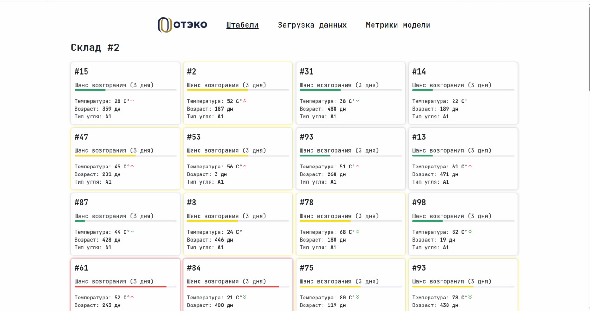
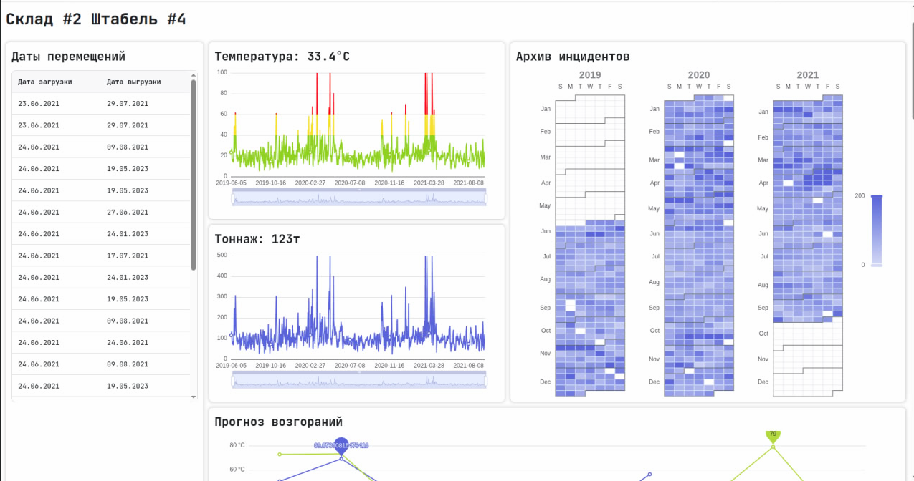
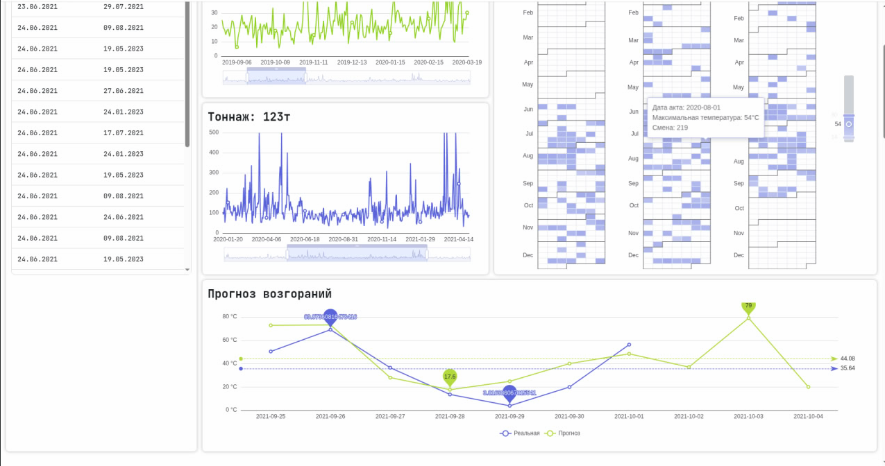

# Фронтенд проетка `coal-dashboard`



## Запуск

```bash
npm ci
npm run dev
```

Сервер запускается на http://localhost:5173/

## Структура проекта

```
.
├── public          -- статические файлы
└── src             -- исходники проекта
    ├── api         -- описание API ендпоинтов
    ├── components  -- React компоненты
    ├── pages       -- Страницы, используемые в React Router
    └── routes      -- Конфигурация маршрутов React Router
```

## Скриншоты



