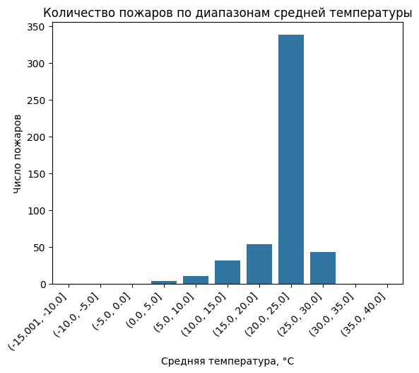
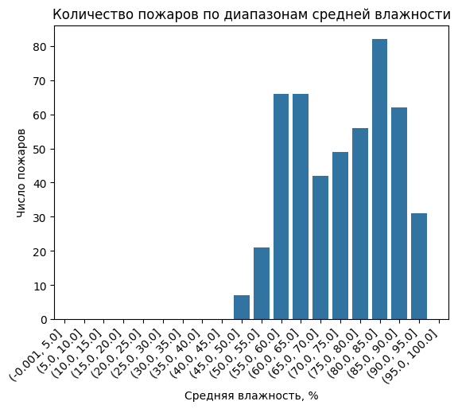
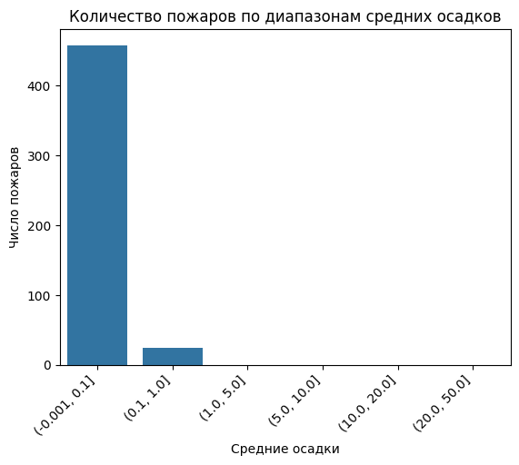
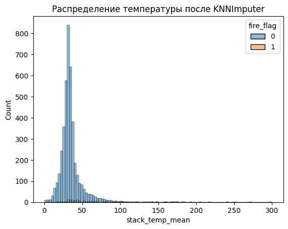
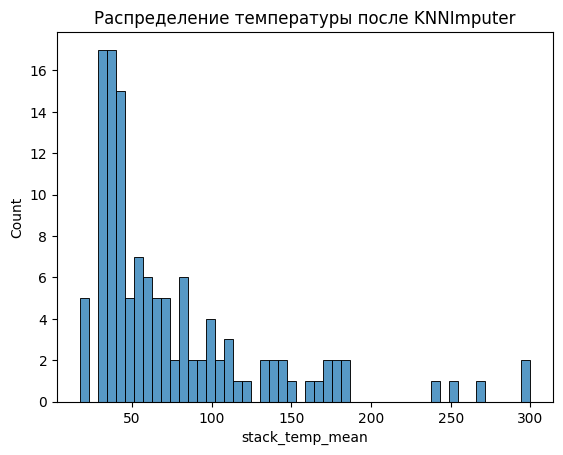
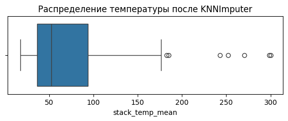

# coal_fires

Прогнозирование температуры угольных штабелей  риска самовозгорания) на основе временных рядов.

ML часть проекта содержит два ключевых ноутбука:

-   **`charcoal_eda.ipynb`** --- очистка данных, исследовательский анализ, формирование временного ряда.
-   **`ML_fitting.ipynb`** --- формированние признаков временных рядов и  извлечение признаков движущимся окном и обучение ML-модели.

------------------------------------------------------------------------

## Структура проекта

    .
    ├── images/                          # поясняющие графики
	├── data/time_series_for_fitting.csv # подготовленные данные для обучения модели 
	├── weights/                         # обученные модели RandomForest  + GradientBoosting 
    ├── charcoal_eda.ipynb               # EDA +  KNNImputer + подготовка time_series_for_fitting.csv
    ├── ML_fitting.ipynb                 # tsfresh признаки в скользящем окне + RandomForest
    └── README.md

------------------------------------------------------------------------

## `charcoal_eda.ipynb` --- подготовка и EDA

Основные шаги:

1.  **Загрузка данных и подготовительные операции**
    -   fires, supplies, temperature, weather(2015--2021)
    -   приведение типов, удаление дубликатов.
    -   проверка согласованности `stack_id`, `depot`, температуры и связывания с началом самовозгорания.
2.  **EDA**
    -   распределения температуры,
    -   динамика пожаров,
    -   базовые корреляции погоды и температуры.

3. **Заполнение пропусков** `KNNImputer`
	
4.  **Агрегация во временные ряды**
    -   объединение температуры, погодных признаков, характеристик
        штабеля,
    -   сохранение итогового датасета:\
        **`time_series_for_fitting.csv`**

Этот файл используется для обучения модели-регрессора.

### Ключевые графики анализа данных 

------------------------------------------------------------------------

## `ML_fitting.ipynb` --- вычисление tsfresh признаков и обучение модели 

### Формирование окон временных рядов
- Используется `cut_time_series_frames`
- Окно: `history_len` дней истории + 1 день таргета (`target_temp`)
- Учитываются пропуски и разрывы дат

### Стратифицированный train/test split
- Функция: `stratified_split_by_windows`
- Стратификация по наличию пожара внутри окна
- Обеспечивает одинаковое распределение пожарных событий в train и test

### Извлечение признаков (tsfresh)
- mean, std, min, max  
- skewness, kurtosis  
- absolute_sum_of_changes  
- autocorrelation (1–3)  
- Плюс статические признаки последнего дня окна

------------------------------------------------------------------------

### Обучение модели

-   модель: **RandomForestRegressor**
-   подбор параметров: **RandomizedSearchCV** (20 итераций)\
-   метрика подбора: `neg_mean_absolute_error` (MAE)

## Метрики ML модели (Baseline: Random Forest)

### **Регрессия (прогноз температуры)**  
- **MAE = 8.1013**  
- **RMSE = 13.7319**  
- **R² = 0.6114**  

### **Классификация пожаров по критической температуре = 50°C**
- **ROC AUC = 0.8968**  
- **Доля предсказанных окон с пожаром = 0.0444**  
- **Доля реальных окон с пожаром = 0.0667**

------------------------------------------------------------------------

## Основной пайплайн

1.  Запустить **`charcoal_eda.ipynb`**\
    → выполнить очистку и EDA\
    →  `time_series_for_fitting.csv`.

2.  Запустить **`ML_fitting.ipynb`**\
    → указать путь к датасету\
    → обучение модели\
    → расчитать метрики.

------------------------------------------------------------------------

